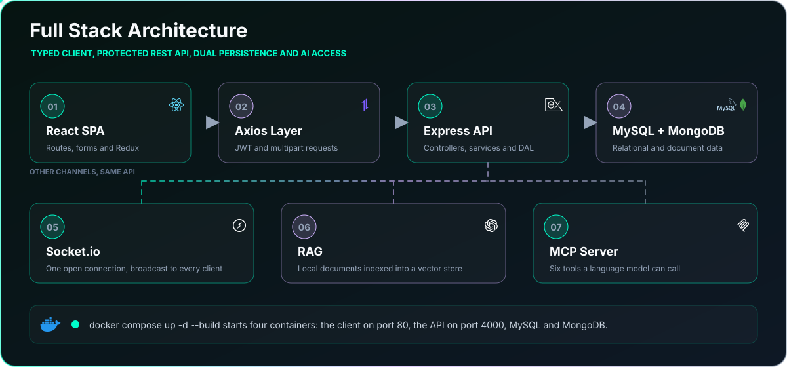

<p align="center">
  
</p>

<p align="center">
  <a href="#running-locally"></a>
  <a href="https://github.com/itaygoldenberg/Northwind"></a>
  <a href="https://www.linkedin.com/in/itay-goldenberg/"></a>
</p>

<p align="center">
  <a href="#overview">Overview</a>&nbsp;&middot;&nbsp;
  <a href="#features">Features</a>&nbsp;&middot;&nbsp;
  <a href="#workflow">Workflow</a>&nbsp;&middot;&nbsp;
  <a href="#technology">Technology</a>&nbsp;&middot;&nbsp;
  <a href="#running-locally">Local setup</a>
</p>

> [!NOTE]
> A full-stack course project demonstrating frontend architecture, protected REST routes and relational persistence.

## Overview

Northwind is a full-stack commerce and operations application composed of a React SPA, an Express REST API and a MySQL database.

The repository demonstrates typed feature boundaries, Redux state, authenticated API communication, relational data access and multipart image workflows.

<table><tr><td align="center" width="25%"><strong>REACT</strong><br /><sub>typed SPA</sub></td><td align="center" width="25%"><strong>EXPRESS</strong><br /><sub>REST API</sub></td><td align="center" width="25%"><strong>MYSQL</strong><br /><sub>Northwind data</sub></td><td align="center" width="25%"><strong>JWT</strong><br /><sub>protected routes</sub></td></tr></table>

| Project detail | Implementation |
|---|---|
| Frontend | React 19, TypeScript, Vite and Redux Toolkit |
| Backend | Express 5 REST API written in TypeScript |
| Data | MySQL with the classic Northwind schema |
| Security | JWT roles, rate limiting and input validation |

## Contents

- [Overview](#overview)
- [Features](#features)
- [Workflow](#workflow)
- [Technology](#technology)
- [Project structure](#project-structure)
- [Running locally](#running-locally)
- [Additional details](#additional-details)
- [Operational notes](#operational-notes)
- [Author](#author)

## Features

### Commerce workspace

The SPA includes product list, details, top-products and image-aware create, edit and delete workflows. Employee and supplier management interfaces are organized as dedicated feature areas.

### Authentication and authorization

Users can register and sign in. JWT data drives role-aware navigation, authenticated write operations and administrator-only deletion.

### Structured frontend architecture

React Router, lazy routes, Redux Toolkit stores, typed models, service classes and an Axios interceptor keep UI, state and transport concerns separated.

### REST and relational data

The bundled Express API implements authentication and protected product routes through controller, service and data-access layers backed by MySQL.

## Workflow

<p align="center">
  
</p>

## Technology

<p align="center">
  
</p>

| Technology | Role |
|---|---|
| React 19 + TypeScript | Typed single page application |
| Redux Toolkit | Products, employees, suppliers and user state |
| React Router | Feature routes, lazy loading and 404 handling |
| React Hook Form | Validated CRUD forms and file inputs |
| Node.js + Express 5 | REST API runtime |
| MySQL + mysql2 | Relational persistence |
| JWT + Zod | Authentication, roles and validation |
| MUI + Emotion | UI components and theme support |

## Project structure

```text
Northwind/
|-- Frontend/             React and TypeScript SPA
|   |-- src/components/   Layout, pages and feature areas
|   |-- src/services/     API service layer
|   |-- src/redux/        Global state
|   `-- src/models/       Typed frontend contracts
|-- Backend/              Express and TypeScript API
|   |-- src/controllers/  HTTP routes
|   |-- src/services/     Business and database logic
|   |-- src/middleware/   Security and error handling
|   `-- src/models/       Backend contracts
|-- Database/
|   `-- northwind.sql     Schema and seed data
|-- docs/                 README-only visual assets
`-- README.md             Project documentation
```

## Running locally

### 1. Database

Import `Database/northwind.sql` into MySQL.

### 2. Backend

Create `Backend/.env` with your own local values:

```env
ENVIRONMENT=development
MYSQL_HOST=localhost
MYSQL_USER=your_mysql_user
MYSQL_PASSWORD=your_mysql_password
MYSQL_DATABASE=northwind
JWT_SECRET=replace_with_a_long_random_secret
PRODUCT_IMAGES_BASE_URL=http://localhost:4000/api/products/images/
HASH_SALT=replace_with_a_private_salt
```

Install and start the API:

```bash
cd Backend
npm install
npm start
```

### 3. Frontend

In a second terminal:

```bash
cd Frontend
npm install
npm run dev
```

Open the local URL printed by Vite. The API listens on `http://localhost:4000`.

## Additional details

| Method | Route | Access |
|---|---|---|
| POST | `/api/register` | Public |
| POST | `/api/login` | Public |
| GET | `/api/products` | Public |
| GET | `/api/products/:id` | Public |
| POST | `/api/products` | Signed-in user |
| PUT | `/api/products/:id` | Signed-in user |
| DELETE | `/api/products/:id` | Administrator |
| GET | `/api/products/images/:imageName` | Public |

## Operational notes

- Never commit Backend/.env or real database credentials.
- Use long, unique JWT and hash secrets outside development.
- Review CORS, uploads, rate limits and database privileges before public deployment.

## Author

<p align="center">
  <strong>Itay Goldenberg</strong><br />
  Full Stack Developer Student
</p>

<p align="center">
  <a href="https://github.com/itaygoldenberg"></a>
  <a href="https://www.linkedin.com/in/itay-goldenberg/"></a>
</p>
